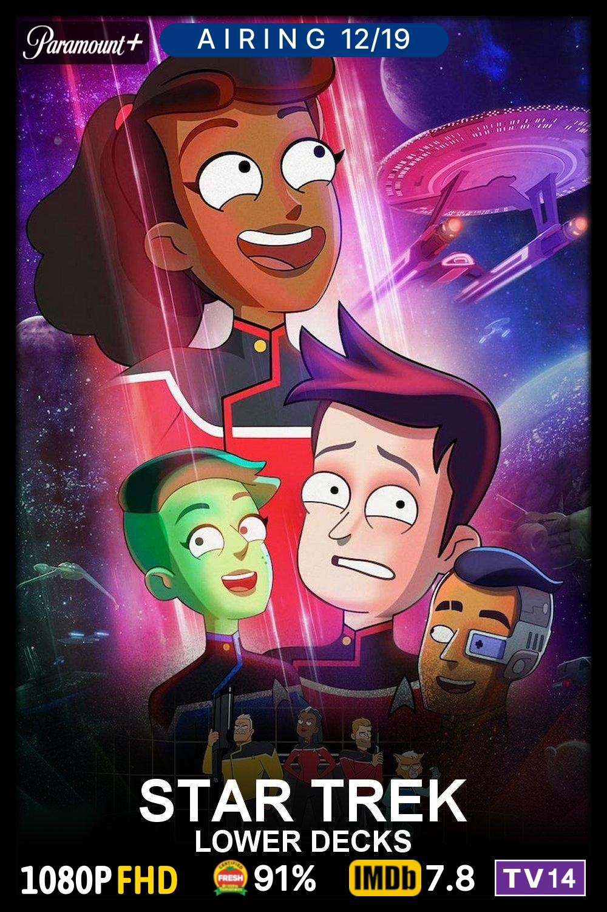
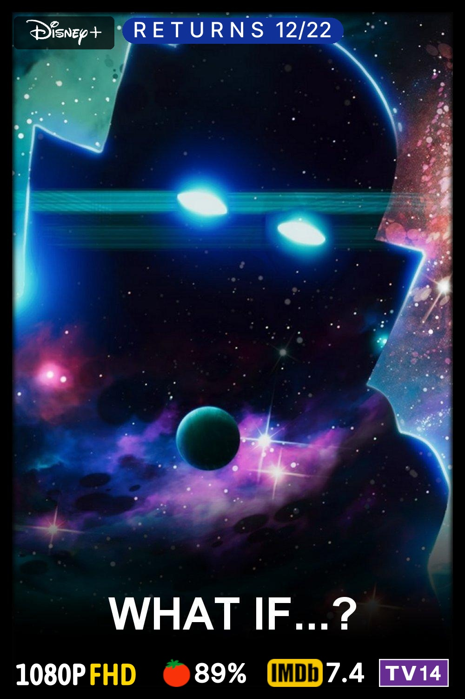
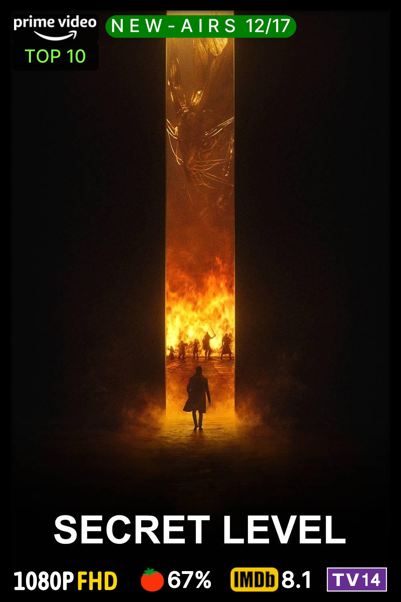
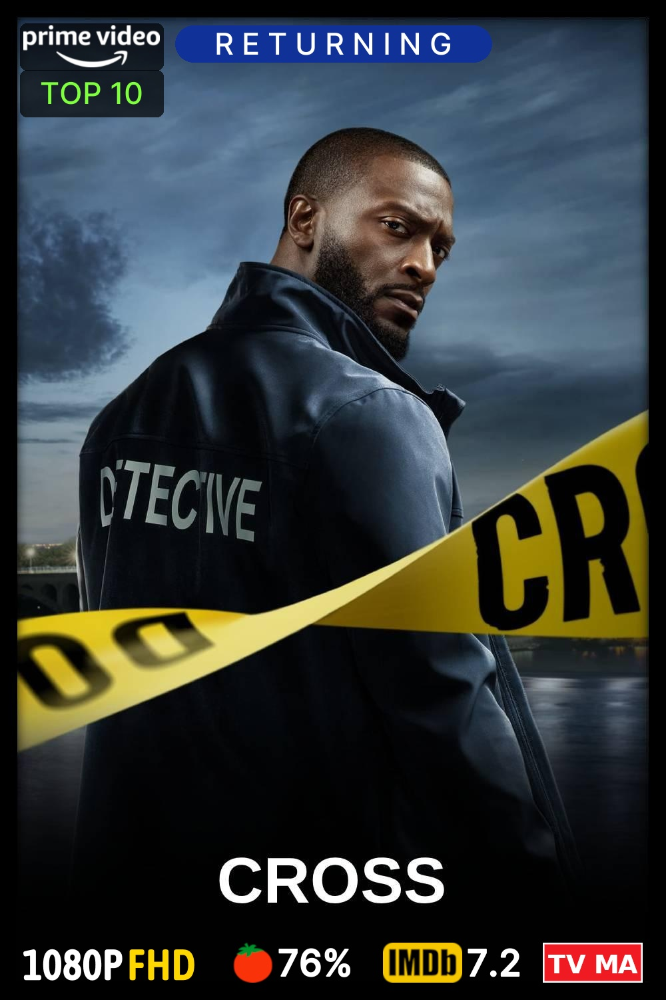
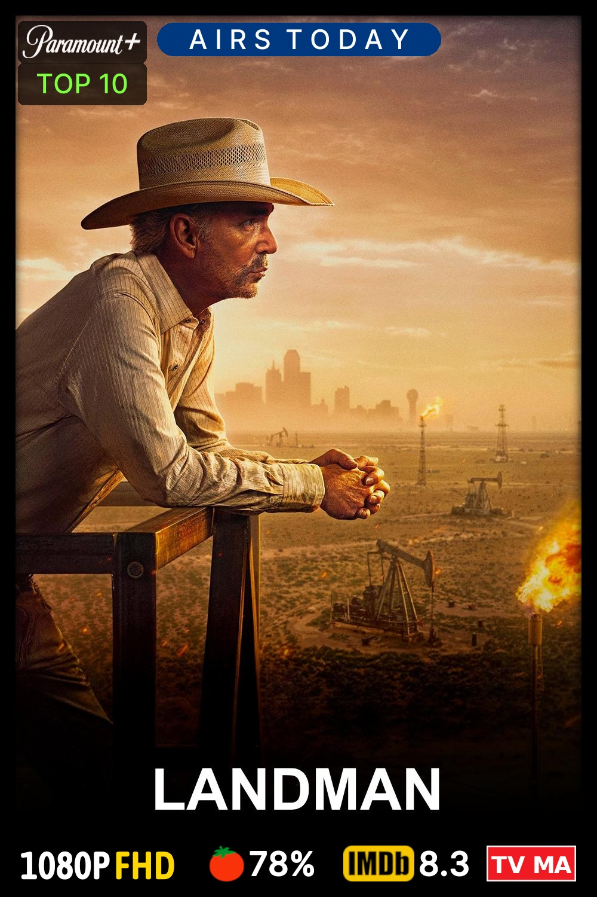
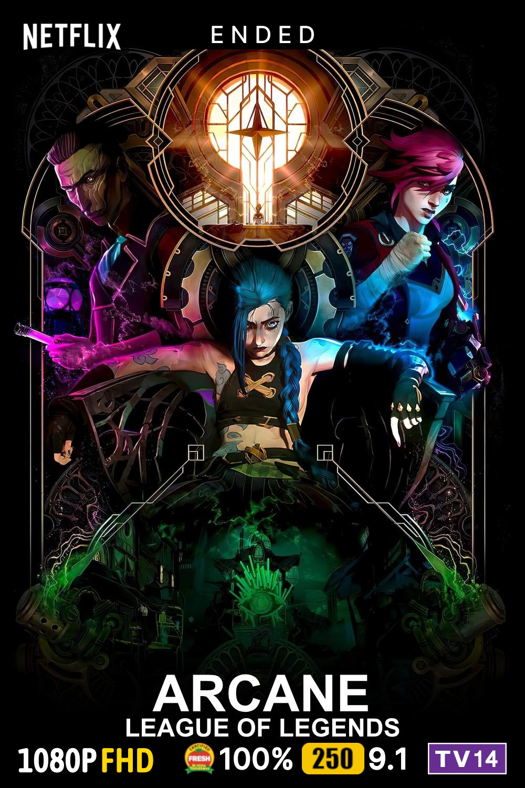
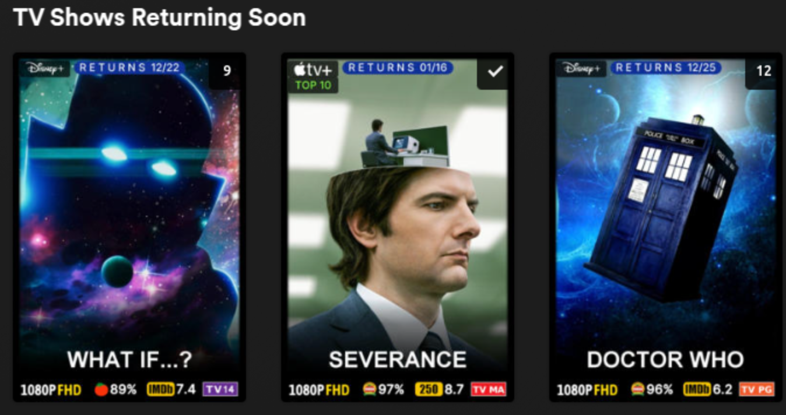

<div align="center"><h1>KoManager</h1></div>
<div align="center">Creates customized YAML files that can be used in <a href="https://github.com/Kometa-Team/Kometa">Kometa</a>.</div><br>
<div align="center">- Show Status Overlays - (Upcoming, Returning, Ended, Canceled, New Series,</div>
<div align="center">New - Airs MM/DD, Airing, Airs Next MM/DD, and Returns MM/DD)</div>
<div align="center">KoManager will update dates daily to keep overlays fresh.</div><br>
<div align="center">- 'Returning Soon' collection to display shows that will return to airing.</div><br>
<div align="center">- 'In History' collection to display items released in your library from this day/week/month in history.</div><br>
<div align="center">- 'NEW RELEASE' status overlay for movie posters .</div><br>
<br>
<div align="center">Inspired by <a href="https://github.com/InsertDisc/pattrmm">pattrmm</a> by InsertDisc</div>
<br>
<div align="center"> Example Statuses</div>
<div align="center">     <br>       </div><br>
<div align="center">Example Posters</div>
<div align="center">      </div>
<div align="center">      </div>
<br>
<div align="center">Example Collection</div>
<div align="center"></div>

## What does this script do?
If you are using [Kometa](https://github.com/Kometa-Team/Kometa) to manage your Plex Media Server, `KoManager` can create YAML files used by Kometa to add a status overlay to your posters. This overlay will show users the airing status of TV show media in your library. The default status overlay in Kometa displays the status of shows as returning, ended, or canceled. YAML files created by `KoManager` can instruct Kometa to include airing and returning dates, which are updated daily, to provide users with more information. (My significant other loves being able to quickly see when her shows are on and returning!)

A 'New Release' overlay similar to the status overlay can also be created.
`KoManager` can also create a 'Returning Soon' and 'In Hisotry' collection YAMLs that will display on Plex's home and library recommendation pages if desired.

## How does this script work?
Once set up, the script will create a default settings file in the main config folder (see below), allowing you to customize the look of your overlays, collections, etc. You can adjust the size, color, font, location, etc., of your overlay to your liking. Collection modification is also possible. You must have knowledge of how Kometa uses these settings or use the default status settings to create overlays just like in the pictures above.

After adjusting your settings file, you will run the script again. It will then create a YAML for each section designated in the settings file. One can pick and choose which options to use. These YAML files can be created in your config folder, directly where you keep your Kometa overlay YAMLs, or other locations you choose. The script will run on a schedule and adjust the dates in the YAML daily to update the overlay dates or collection dates.

## Getting Started
See the `KoManager` [Wiki](https://github.com/dweagle/KoManager/wiki) for more help.

1. Install `KoManager` locally or use the Docker image to create a Docker container (see below).

2. Start the script/container to have it create your settings file. Adjust settings to your liking.

3. After adjusting your settings, start the script/container again. The YAML files will be created at your designated location from the settings file.

4. Adjust your Kometa config [(using files)](https://kometa.wiki/en/latest/config/files/#location-types-and-paths) to use these YAML files in your overlay/collection run. Run Kometa to apply.

5. Set your daily schedule for your script/container and enjoy! Container runtime can be set with an environment variable. Local runs can be set with a cron/task scheduler job.

# Default Settings File
This default setting file will be created on the first run for you. It will create YAML files that produce overlays or collections like the ones in the images at the top of the README. Settings that Kometa uses to apply overlays/collections can be modified in this settings file.
```yaml
# Settings for overlay configurations
Kometa can use the TMDB Discover API to grab series info to find air dates, etc. Using the default settings
in this file limits the "junk" show results that are pulled for a library with mainly US, English language shows.  
You will get fewer "No TVDB/TMDB id" errors in Kometa when it parses this info.

If you have an anime library or a TV show library with lots of non-English shows, it may be best
to NOT use watch_region or with_original_language settings.

libraries:                   # Plex library (SHOWS ONLY) names to create Kometa overlays for.
  TV Shows:                  # Change, add, or remove - Need at least one library.
    is_anime: False          # True removes TMDB with_original_language:'en' setting for use with Anime libraries or libraries with non-English shows.         
    use_watch_region: True   # False removes TMDB watch_region and watch_monetization settings.
  4k TV Shows:
    is_anime: False
    use_watch_region: True
  Anime:
    is_anime: True
    use_watch_region: True

# These settings are used across all status overlays.  
# This creates a consistent overlay across all shows.    
overlay_settings:                  
  days_ahead: 30                # Days ahead for Returning Next (30 Days Max).
  date_delimiter: "/"           # Change date delimiter that displays on overlay - Default "/" - must be "/", ".", "-", or "_".
  remove_leading_zero: False    # True removes the leading zero from MM/DD for overlays.  Ex. 01/02 becomes 1/2.
  overlay_save_folder: /path/to/folder     # Kometa overlay folders (leave blank for config folder). Kometa must have permissions to this folder.
  font: /path/to/kometa-font    # Path placed in final YAML for Kometa to use. Kometa must have permissions for this folder. Will default to included font in 'config/fonts/Inter-Medium.ttf'.
  font_size: 45                 # Font size for overlay text.
  font_color: "#FFFFFF"         # Font color (Kometa requires #RGB, #RGBA, #RRGGBB or #RRGGBBAA, e.g., #FFFFFF).
  horizontal_align: center      # Horizontal alignment (e.g., center, left, right).
  vertical_align: top           # Vertical alignment (e.g., top, bottom, etc.).
  horizontal_offset: 0          # Horizontal offset in pixels.
  vertical_offset: 38           # Vertical offset in pixels.
  back_width: 475               # Width of the overlay background.
  back_height: 55               # Height of the overlay background.
  back_radius: 30               # Corner radius for rounded backgrounds.
  ignore_blank_results: "true"  # Kometa error processing (true or false).

  # TMDB DISCOVER SETTINGS #    SEE TMDB API FOR MORE DETAILS - THESE DEFAULT SETTINGS ARE IDEAL.
  with_status: 0                # TMDB DISCOVER - Returning Series: 0 Planned: 1 In Production: 2 Ended: 3 Canceled: 4 Pilot: 5.
  watch_region: US              # TMDB DISCOVER - Default US - Must be a valid TMDB region code.
  with_original_language: en    # TMDB DISCOVER - Default is en (English) - Must be a valid TMDB language code.
  limit: 500                    # TMDB DISCOVER - API Results limit. Default is 500.
  with_watch_monetization_types: flatrate|free|ads|rent|buy  # TMDB DISCOVER - Options: flatrate, free, ads, rent, buy - can use ,(and) or |(or) as separators.

# You can decide here if you want to use each overlay, change the font or backdrop color for individual overlays, or change the text.
use_overlays:
  upcoming_series:
    use: True                   # Use this overlay: True or False.
    back_color: "#FC4E03"       # Default is "#fc4e03" - Overlay color override for this overlay only.
    text: "U P C O M I N G"     # Change to desired spacing/text.
    font_color: "#FFFFFF"       # Font color override for this overlay only (Kometa requires #RGB, #RGBA, #RRGGBB or #RRGGBBAA).
    
  new_series:
    use: True
    back_color: "#008001"       # Default is "#008001".
    text: "N E W  S E R I E S"
    font_color: "#FFFFFF"

  new_airing_next:
    use: True
    back_color: "#008001"       # Default is "#008001".
    text: "N E W - A I R S"     # Displays as N E W - A I R S 12/22 on overlays.
    font_color: "#FFFFFF"

  airing_series:
    use: True
    back_color: "#003880"       # Default is "#003880".
    text: "A I R I N G"
    font_color: "#FFFFFF"

  airing_today:
    use: True
    back_color: "#003880"       # Default is "#003880".
    text: "A I R S  T O D A Y"
    font_color: "#FFFFFF"

  airing_next:
    use: True
    back_color: "#003880"       # Default is "#003880".
    text: "A I R I N G "        # Displays as A I R I N G  12/23 on overlays.
    font_color: "#FFFFFF"

  ended_series:
    use: True
    back_color: "#000000"       # Default is "#000000".
    text: "E N D E D"
    font_color: "#FFFFFF"

  canceled_series:
    use: True
    back_color: "#CF142B"       # Default is "#CF142B".
    text: "C A N C E L E D"
    font_color: "#FFFFFF"

  returning_series:
    use: True
    back_color: "#103197"       # Default is "#103197".
    text: "R E T U R N I N G"
    font_color: "#FFFFFF" 

  returns_next:
    use: True
    back_color: "#103197"       # Default is "#103197".
    text: "R E T U R N S "      # Displays as R E T U R N S  12/23 on overlays.
    font_color: "#FFFFFF"     

# Creates a Returning Soon collection YAML file that can be used in Kometa to display a collection in Plex.
returning_soon_collection:
  use: True                     # True to create collection YAML. False to not create.
  collection_save_folder: /path/to/folder      # Path to collection YAML folder (leave blank for /config folder). Kometa must have permissions to this folder.
  collection_days_ahead: 30     # Days past current date to look for new airing episodes to consider returning soon. Default is 30.
  days_last_aired: 45           # Days since most recent episode aired to consider for returning soon. 30 to 45 is ideal.  Default is 45.  
  use_poster: false             # False removes the poster source/path from the collection YAML.  Set to true if you want to use a specific poster.  Set to false if Kometa uses assets folder for posters.
  poster_source: url            # url or file. url for outside source, file for local poster. Defaults to url and Kometa GitHub poster.  
  poster_path: /path/to/kometa-poster     # Path placed in final YAML for Kometa to use. Kometa must have permissions for this folder. Can be a URL link or file path. Defaults to url Kometa poster included in config.
  visible_home: "true"          # Collection visible on home page. "true" or "false".
  visible_shared: "true"        # Collection visible on friends/users home page. "true" or "false".
  visible_library: 'true'       # Collection visible on library recommendations page. "true" or "false"
  summary: "Shows returning soon!" # Collection summary displayed on Plex collection page.
  minimum_items: 1              # Minimum items in collection before being considered for deletion.
  delete_below_minimum: 'true'  # Will delete collection in Plex if it goes below minimum items.
  sort_title: "!010_Returning"  # Sort order title of collection in Plex.

in_history_collection:
  use: true                     # True to create collection YAML. False to not create.
  in_history_save_folder: path/to/folder      # Path to collection YAML folder (leave blank for /config folder). Kometa must have permissions to this folder.
  in_history_range: weeks      # days, weeks, or months - Default is weeks.  Creates a collection of library items that released on this day, week, or month in history.
  starting_year: 1980          # Release year to start collection
  ending_year: 2024            # Release year to end collection
  use_poster: false             # False removes the poster source/path from the collection YAML.  Set to true if you want to use a specific poster.  Set to false if Kometa uses assets folder for posters.
  poster_source: url            # url or file. url for outside source, file for local poster. Defaults to url and Kometa GitHub poster.  
  poster_path: /path/to/kometa-poster     # Path placed in final YAML for Kometa to use. Kometa must have permissions for this folder. Can be a URL link or file path. Defaults to url Kometa poster included in config.
  visible_home: "false"          # Collection visible on home page. "true" or "false".
  visible_shared: "false"        # Collection visible on friends/users home page. "true" or "false".
  visible_library: 'true'       # Collection visible on library recommendations page. "true" or "false"
  minimum_items: 1              # Minimum items in collection before being considered for deletion.
  delete_below_minimum: 'true'  # Will delete collection in Plex if it goes below minimum items.
  sort_title: "!012_In_History"  # Sort order title of collection in Plex.

# Creates an overlay YAML that will add a "N E W  R E L E A S E" status overlay on movies considered to be new release.
movie_new_release:
  use: true                     # True to create collection YAML. False to not create.
  new_movie_save_folder: /path/to/folder        # Path to overlay YAML folder (leave blank for /config folder) Kometa must have permissions to this folder.
  days_to_consider_new: 90      # Min 1, Max 90.
  back_color: "#008001"
  text: "N E W  R E L E A S E"  # Change to desired spacing/text.
  font_color: "#FFFFFF"         # Font color override for this overlay only (Kometa requires #RGB, #RGBA, #RRGGBB or #RRGGBBAA).
```

# Docker Setup
### Image available on [dockerhub](https://hub.docker.com/r/dweagle/komanager)
Eample Docker Compose:
```YAML
services:
  komanager:
    image: dweagle/komanager:latest
    container_name: komanager
    user: 1000:1002
    environment:
      - TZ=America/New_York  # System time and called for some overlays
      - SCHEDULE=06:00       # Schedule run time
      - RUN_NOW:false        # true will bypass the schedule once on container startup
    volumes:
      # Mount your local directory to the containers internal config folder.
      # By default, the logs, settings, and overlays/collections will be created here.
      - /path/to/komanager/config:/config:rw 
      # If you want overlay/collection files to go to a seperate folder, ex. inside kometa, do
      # another mount to the save folder you entered in the settings (overlay_save_folder:, etc.)
      # Make sure the path matches the settings file path.
      - /path/to/kometa/overlays:/path/to/kometa/overlays:rw
    restart: unless-stopped  
```
Example Docker CLI:
```
docker run -d \
  --name komanager \
  --user 1000:1002 \
  -e TZ=America/New_York \
  -e SCHEDULE=06:00 \
  -e RUN_NOW=false \
  -v /path/to/komanager/config:/config:rw \
  -v /path/to/kometa/overlays:/path/to/kometa/overlays:rw \
  --restart unless-stopped \
  dweagle/komanager:latest
```

### Manual Run
If you are doing testing on your overlay/collection settings and don't want to restart the container multiple times or set the env RUN_NOW variable to true, you can connect to the running container and run the following command.  It will run the main.py script and do a complete run.
```ruby
python3 komanager.py -r
```
or
```ruby
python3 komanager.py --run-now
```
# Local Setup (Linux)
Local setup requires a recent version of Python to be installed.

1. Clone the repository to your home directory and then enter that directory.
```YAML
git clone https://github.com/dweagle/komanager
```
```YAML
cd komanager
```
2. Inside that directory create a virtual environment.
```YAML
python3 -m venv komanager-venv
```
3. Activate the virtual environment.
```YAML
source komanager-venv/bin/activate
```
4. Install any python requirements.
```YAML
python3 -m pip install -r requirements.txt
```
5. Run komanager. This will create a settings file that you can edit your overlay and collection preferences. This runs the script one time and exits.
```YAML
python3 komanager.py -r
```
6. After adjusting your settings, run the script again to create your Kometa YAMLs.
```YAML
python3 komanager.py -r
```
7. Deactivate your virtual environment.
```YAML
deactivate
```
8. You can return to this virtual environment daily and run the script manually using the commands from above. Or, set up a cron job for automated daily scheduling using the command below along with your cron job settings. A runtime set anytime before your Kometa run would be ideal.  This will ensure Kometa has updated dates in the YAML files.
```YAML
cd /path/to/komanager && komanager-venv/bin/python3 komanager.py -r 
```
